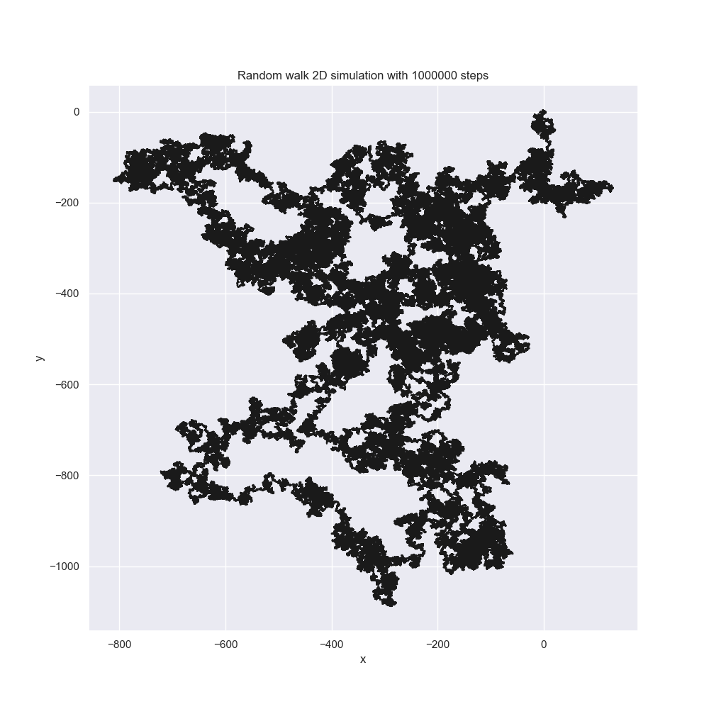
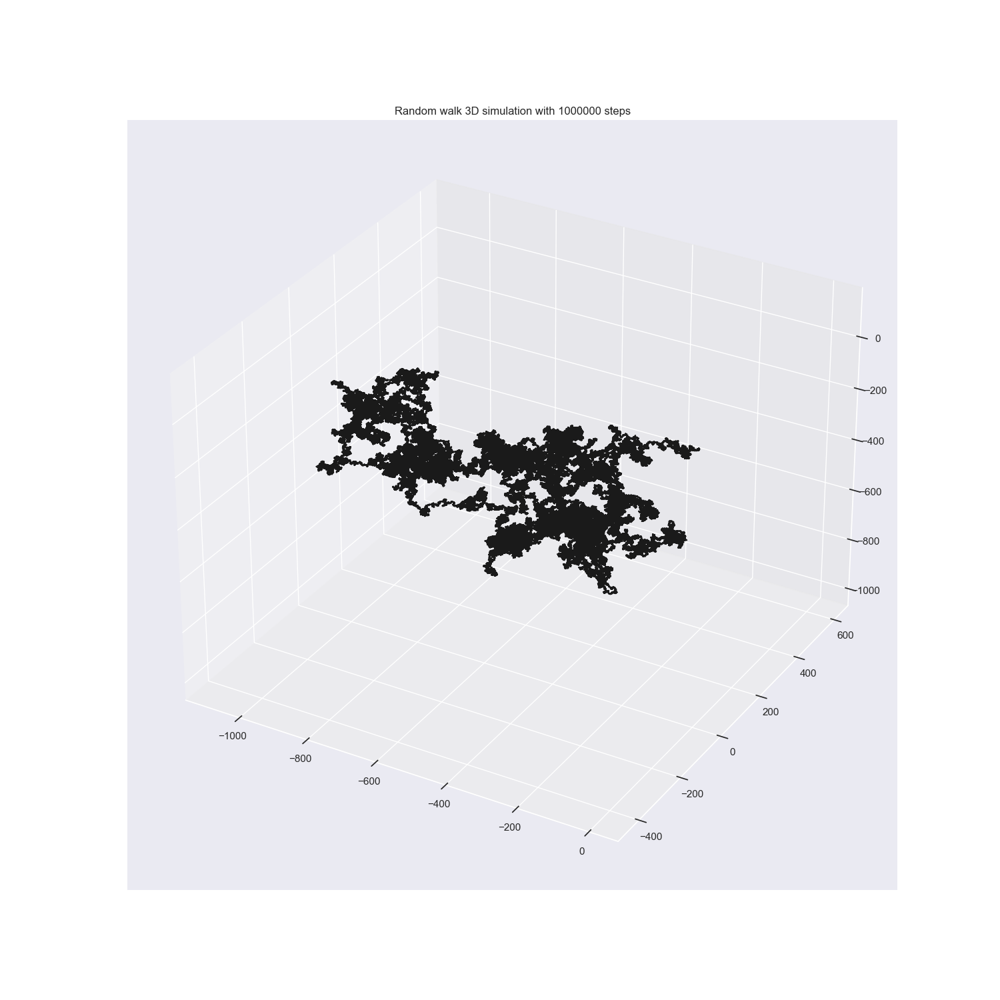
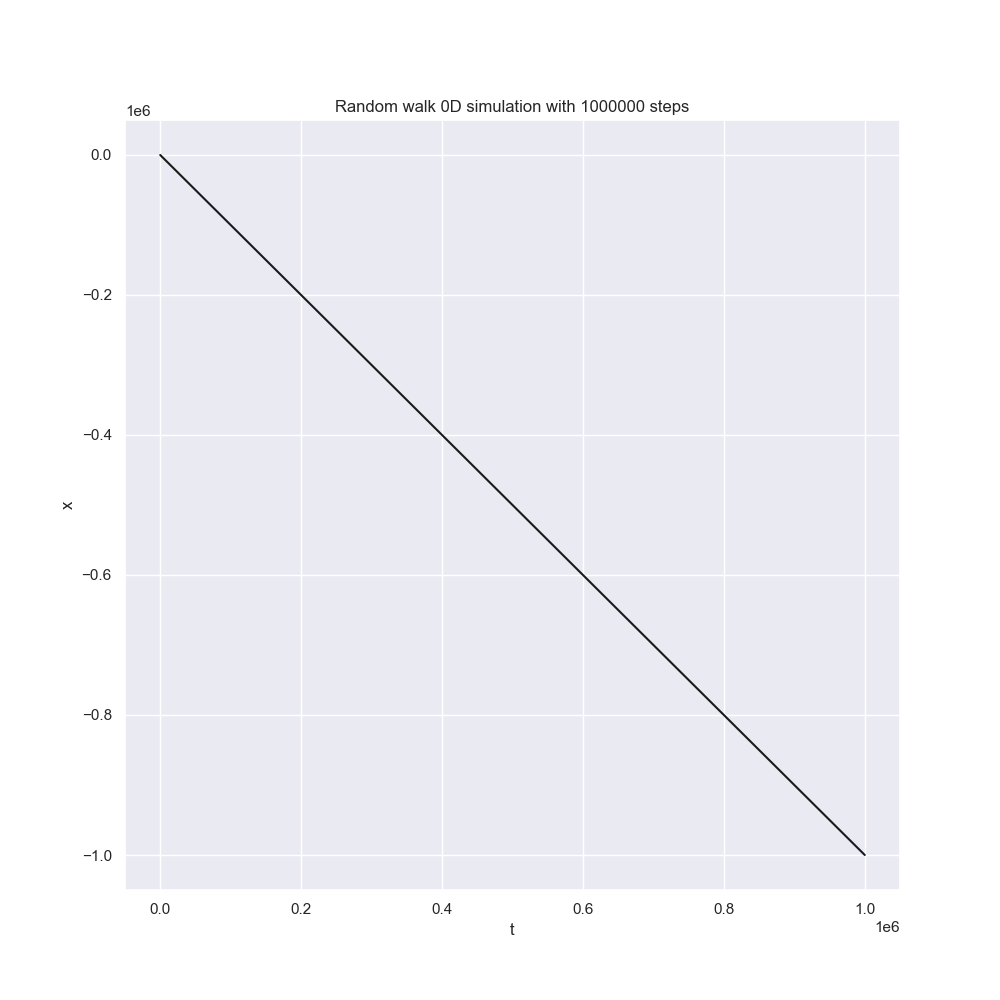
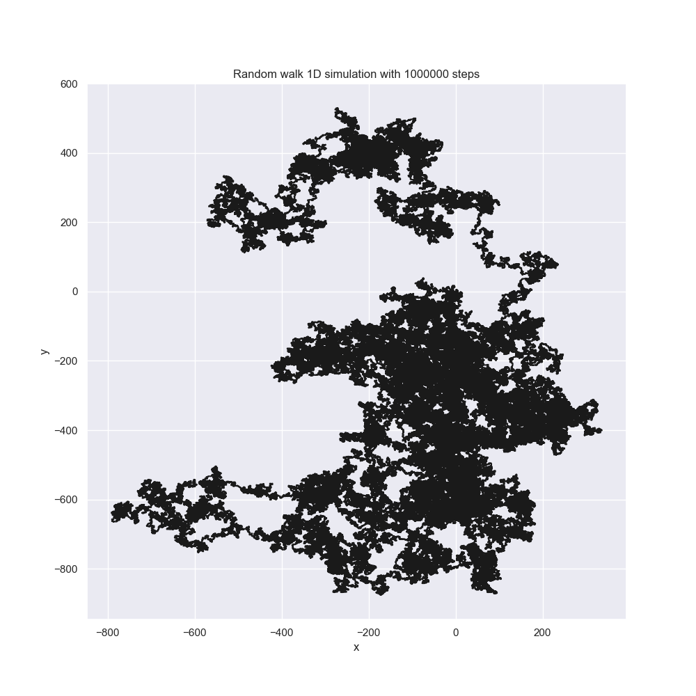
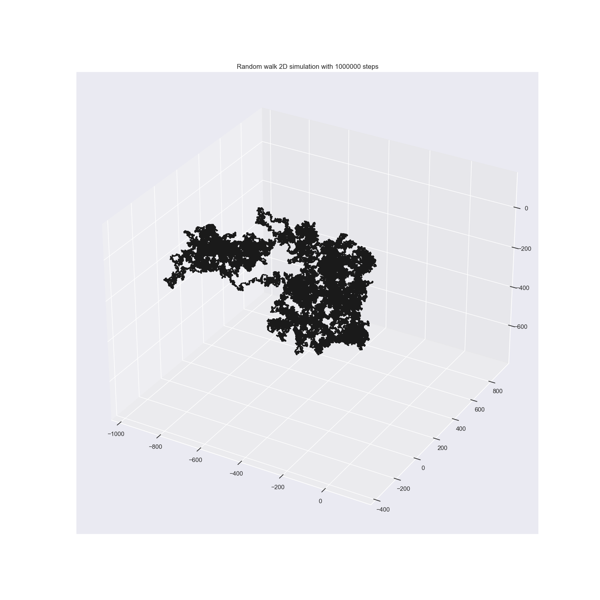

# Random walks

_Simulations of various types of random walks._

- Simple random walks
  - [x] Random walk on regular 1D lattice where you can step in any of the two directions `{↑, ↓}` with the same probability.
  - [x] Random walk on regular 2D lattice where you can step in any of the four directions `{↑, ←, ↓, →}` with the same probability.
  - [x] Random walk on regular 3D lattice where you can step in any of the six directions `{↑, ←, ↙, ↓, →, ↗}` with the same probability.

- Restricted random walks
  - [x] Random walk on regular 1/2/3D lattice without immediate return where you can step in three possible directions with the same probability,
      the first step is in any direction.
  - [ ] Random walk on the square lattice without crossing i.e. self-avoiding random walk.

See the examples:

- [random_walk.py module](source/random_walk.py)
- [random_walk.ipynb notebook](source/random_walk.ipynb)
- [random_walk.f90 module](source/random_walk.f90)
- [random_walk_main.f90 program](source/random_walk_main.f90)
- [random_walk_main.f90 test](source/random_walk_test.f90)

### Simple random walks





### Restricted random walks





## Build and run

All outputs such as data and images are located in `output` folder.
The presented images were produced by Python implementation.

### Python

You need Python version 3.10+.

Create a virtual environment.

      python -3.10 -m venv .venv
      .venv\scripts\activate
      pip install matplotlib, seaborn, numpy, pandas

Run the simulations.

      python .\source\random_walk.py 1_000_000 3 123321 True # 1D simulation with 100_000 steps
                                                         ^------ Run solution (example) (True | False)
                                                 ^-------------- Random seed
                                               ^---------------- Dimension (1 | 2 | 3)
                                      ^------------------------- Number of steps per walk

### Fortran

Work-in-progress: The Fortran version is almost finished, but data are not at the shape suitable for analysis.

Compile and run *main* program:

```powershell
gfortran source\random_walk.f90 source\random_walk_main.f90 -o build\random_walk_main.exe
.\random_walk_main.exe 123 100 1 > data.psv
```

Compile and run *test* program:

```powershell
gfortran source\random_walk.f90 source\random_walk_test.f90 -o build\random_walk_test.exe
.\build\random_walk_test.exe
```

Also, you can execute the `project.bat` with `build` command and then run programs:

```powershell
.\project.bat build

.\build\random_walk_main.exe 123 100 1
.\build\random_walk_test.exe
```
